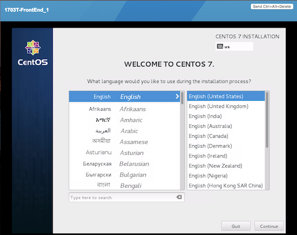

.. _DeployOS:

Deploying a Development Environment with the vss-cli
====================================================

This tutorial details how to deploy a development environment in the ITS Private Cloud using
the VSS CLI. It assumes you already have set up a VSS account with access to the REST API.

Launch Instance
---------------

Before launching the virtual machine instance we need the following items:

* Operating system
* Network
* Folder
* ISO image

Then, all is ready to deploy a brand new virtual machine.

Operating system
~~~~~~~~~~~~~~~~

Run ``vss-cli compute os ls`` to display the list of supported operating systems in
the ITS Private Cloud. In order to narrow down the list to only **CentOS** operating
systems, use the ``--filter-by/-f`` option which is structured
``<field_name>=<operator>,<value>`` and available operators are
**eq, ne, lt, le, gt, ge, like, in**. So, to limit results to just **CentOS**, use
the following filter:

.. note:: This version of the VSS CLI supports providing OS reference
    not only using the ``guest_id``, but also the ``full_name`` or Id.
    In case of multiple results, the CLI prompts to select the right instance.

.. code-block:: bash

    vss-cli compute os ls --filter-by full_name=CentOS

      id  guest_id         full_name            family
    ----  ---------------  -------------------  ----------
      24  centos64Guest    CentOS 4/5 (64-bit)  linuxGuest
      70  centos6_64Guest  CentOS 6 (64-bit)    linuxGuest
      26  centos6Guest     CentOS 6             linuxGuest
      15  centos7_64Guest  CentOS 7 (64-bit)    linuxGuest
      78  centos7Guest     CentOS 7             linuxGuest
      95  centos8_64Guest  CentOS 8 (64-bit)    linuxGuest
       2  centosGuest      CentOS 4/5           linuxGuest

Set the ``OS`` environment variable to ``centos64Guest`` to save the ``guest_id``:

.. code-block:: bash

    export OS=centos64Guest

Network
~~~~~~~

Run ``vss-cli compute net ls`` to list available network segments to your account. You must
have at least ``VL-1584-VSS-PUBLIC`` which is our public network.

.. note:: This version of the VSS CLI supports managing networks
    not only using the ``moref``, but also using names. In case of multiple results,
    the CLI prompts to select the right instance.

.. code-block:: bash

    vss-cli compute net ls -f name=public
    moref              name                description         subnet            ports
    -----------------  ------------------  ------------------  --------------  -------
    dvportgroup-11052  VL-1584-VSS-PUBLIC  VSS Public network  142.1.216.0/23       32

Save ``dvportgroup-11052`` in ``NET`` environment variable:

.. code-block:: bash

    export NET=dvportgroup-11052

By default, the network adapter will use **vmxnet3** which provides ideal performance,
however a few legacy operating systems does not have the drivers. In such case, you can
specify which adapter type between: **e1000e***, **e1000**, **vmxnet2** or **vmxnet3**.
To do so, append the adapter type to the network adapter network as follows:

.. code-block:: bash

    export NET=dvportgroup-11052=e1000e

Folder
~~~~~~

Logical folders can be listed by running ``vss-cli compute folder ls``. Select the target
``moref`` folder to store the virtual machine on:

.. note:: This version of the VSS CLI supports managing logical folders
    not only using the ``moref``, but also using names. In case of multiple results,
    the CLI prompts to select the right instance.

.. code-block:: bash

    vss-cli compute folder ls -f name=API

    moref        name     parent    path
    -----------  -------  --------  ----------------------------
    group-v6736  APIDemo  jm        jm > APIDemo

Set the ``FOLDER`` environment variable to the target folder (the folder moref may vary):

.. code-block:: bash

    export FOLDER=group-v6736

ISO Image
~~~~~~~~~

Since this tutorial creates a virtual machine from scratch, an ISO image is required to
install the operating system. Run ``vss-cli compute iso public ls`` to display  available
ISO images in both the VSS central store and your personal VSKEY-STOR space.

.. note:: This version of the VSS CLI supports managing ISOs
    not only using the path, but also using ``name`` or ``ID`` or ``path``. In case of multiple results,
    the CLI prompts to select the right instance.

.. code-block:: bash

    vss-cli compute iso public ls -f name=Cent%
    path                                                           name
    -------------------------------------------------------------  -------------------------------------
    [vss-ISOs] Linux/CentOS/CentOS-7.0-1406-x86_64-DVD.iso         CentOS-7.0-1406-x86_64-DVD.iso
    [vss-ISOs] Linux/CentOS/CentOS-7.0-1406-x86_64-NetInstall.iso  CentOS-7.0-1406-x86_64-NetInstall.iso
    [vss-ISOs] Linux/CentOS/CentOS-7.0-1406-x86_64-Minimal.iso     CentOS-7.0-1406-x86_64-Minimal.iso

Save the desired path to ``ISO`` environment variable:

.. code-block:: bash

    export ISO='[vss-ISOs] Linux/CentOS/CentOS-7.0-1406-x86_64-DVD.iso'

Deployment
~~~~~~~~~~

Run ``vss-cli compute vm mk shell`` to deploy a virtual machine without an operating system
installed. Before deploying the virtual machine, display what options and arguments the ``shell``
command takes:

.. code-block:: bash

    Usage: vss-cli compute vm mk shell [OPTIONS] NAME

      Create a new VM with no operating system pre-installed.

    Options:
      -d, --description TEXT          A brief description.  [required]
      -b, --client TEXT               Client department.  [required]
      -a, --admin TEXT                Admin name, phone number and email separated
                                      by `:` i.e. "John
                                      Doe:416-123-1234:john.doe@utoronto.ca"
      -r, --inform TEXT               Informational contact emails in comma
                                      separated
      -u, --usage [Test|Prod|Dev|QA]  Vm usage.
      -o, --os TEXT                   Guest operating system id.  [required]
      -m, --memory INTEGER            Memory in GB.
      -c, --cpu INTEGER               Cpu count.
      --cores-per-socket INTEGER      Cores per socket.
      -f, --folder TEXT               Logical folder moref name or path.
                                      [required]
      --scsi TEXT                     SCSI Controller Spec <type>=<sharing>.
      -i, --disk TEXT                 Disk spec
                                      <capacity>=<backing_mode>=<backing_sharing>.
                                      optional: backing_mode, backing_sharing
                                      [required]
      -n, --net TEXT                  Network adapter <moref-or-name>=<nic-type>.
                                      [required]
      -t, --domain TEXT               Target fault domain name or moref.
      --notes TEXT                    Custom notes.
      -s, --iso TEXT                  ISO image to be mounted after creation
      -e, --extra-config TEXT         Extra configuration key=value format.
      --power-on                      Power on after successful deployment.
      --template                      Mark the VM as template after deployment.
      --vss-service TEXT              VSS Service related to VM
      --instances INTEGER             Number of instances to deploy  [default: 1]
      -w, --firmware TEXT             Firmware type.
      --storage-type TEXT             Storage type.
      --tpm                           Add Trusted Platform Module device.
      --retire-type [timedelta|datetime]
                                      Retirement request type.
      --retire-warning INTEGER        Days before retirement date to notify
      --retire-value TEXT             Value for given retirement type. i.e.
                                      <hours>,<days>,<months>
      --help                          Show this message and exit.

Now that we have everything, proceed to deploy a new virtual machine with 1GB of memory,
1 vCPU, 20GB disk and 100GB disk (``independent_persistent``: not affected by snapshots)
and a tag ``Project:CMS`` as follows:

.. code-block:: bash

    vss-cli  --wait compute vm mk shell --description 'Application server' --client EIS \
    --os centos8 --memory 1 --cpu 1 --folder APIDemo \
    --disk 20 --disk 100=independent_persistent \
    --net PUBLIC --iso centos \
    --storage-type ssd \
    --notes 'Project: CMS' --power-on \
    AppServer3

.. note::

    Deploy multiple instances with the ``--instances`` flag.

A confirmation email will be sent and the command will return the request ``id`` and
``task_id`` as follows:

.. code-block:: bash

    id                  : 78
    status              : IN_PROGRESS
    task_id             : af6e1d45-6890-4329-b2c2-c3e3d6d28cfd
    message             : Request has been accepted for processing
    ⏳ Waiting for request 78 to complete...
    🎉 Request 78 completed successfully:
    warnings            : Fault Domain: Cluster1 (domain-c63), Created in: VSS > Development > Dev03 (group-v907),
                          Network adapter 1 (vmxnet3): 00:50:56:b0:0e:30: Quarantine,
                          Successfully powered on.
    errors              :

In matter of seconds, a confirmation email will be sent with the allocated IP address, if
``VL-1584-VSS-PUBLIC`` was selected.

Manage Request
--------------

If you prefer to validate the status of the request with VSS CLI, run ``vss-cli request new ls`` to
display a list of your request history.

This command supports filter and sorting by using the ``--filter-by/-f`` and ``--sort/-s``
respectively. Filter list in the following format ``<field_name>=<operator>,<value>``
where operator is **eq, ne, lt, le, gt, ge, like, in**. For example: status,eq,Processed.
Sort list in the following format ``<field_name> <asc|desc>``.

In order to obtain the last request submitted, status and resulting virtual machine ``uuid``, run
the following command:

.. code-block:: bash

    vss-cli request new ls -s created_on=desc -c 1

      id  created_on                   updated_on                   status     vm_moref    vm_name          approval.approved    built_from
    ----  ---------------------------  ---------------------------  ---------  ----------  ---------------  -------------------  ------------
      78  2020-04-24 Fri 17:06:49 EDT  2020-04-24 Fri 17:06:51 EDT  PROCESSED  vm-2185     2004T-Frontend3  True                 os_install

Access Instance
---------------

Since we added the ``--power-on`` option, the virtual machine should have been powered on
right after the Guest Operating System Customization task completed.

In a few minutes the virtual machine will show the hostname and ip configuration by running
``vss-cli compute vm get <name-or-vm-id> guest``:

.. code-block:: bash

    vss-cli compute vm get docker-node1 guest

    hostname            : fe2
    ip_address          : 142.1.217.228, fe80::250:56ff:fe92:323f
    full_name           : CentOS 8 (64-bit)
    guest_id            : centos8_64Guest
    running_status      : guestToolsRunning

The **Guest Host Name** shows that the hostname has been changed, and now
you will be able to access via either ``ssh`` or the virtual machine console:

.. code-block:: bash

    ssh username@<ip-address>

.. code-block:: bash

    vss-cli compute vm get Frontend2 vsphere-link -l

.. _`VSKEY-STOR`: https://vskey-stor.eis.utoronto.ca
.. _`WebdavClient`: http://designerror.github.io/webdav-client-python/
.. _pip: http://www.pip-installer.org/en/latest/
.. _`download the tarball`: https://pypi.python.org/pypi/vsscli
.. _`GitLab instance`: https://gitlab-ee.eis.utoronto.ca/vss/vsscli
