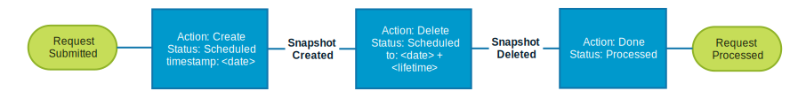

.. _Snapshot:

Manage virtual machine snapshots
================================

This tutorial details how to create, revert and manually delete a
virtual machine snapshot. Before proceeding, a brief talk about
virtual machine snapshots and side effects on running instances is
described below.

Snapshots
---------
A virtual machine snapshot is not a copy so it cannot be treated as
a direct backup. A snapshot file is simply a log of changes to the
original virtual disk. The virtual machine is running on the most
current snapshot, not the original vmdk disk files. To reiterate:
**snapshots are not copies of the VM's original vmdk disk files.**
Taking a snapshot does not create a complete copy of the original
vmdk disk file, rather it only copies the delta disks.

Side effects
~~~~~~~~~~~~
* Decreased performance if there are too many delta files in a chain
  (caused by having too many snapshots).
* Decreased performance if delta files become too large.
* Cannot increase Virtual Disk size while snapshots are active.
* Delta files can grow to the same size as the original base
  disk file: a virtual machine's provisioned storage size can grow
  to ( its original size ) multiplied by ( the number of snapshots ).

Lifecycle
~~~~~~~~~
The following diagram describes the ITS Private Cloud virtual machine
snapshot lifecycle:

When a virtual machine snapshot request is submitted, the lifecycle starts.
By default, a virtual machine snapshot in the ITS Private Cloud has a
**start** and **end** date based on the **timestamp** and **lifetime**.
For example, if the timestamp is set to ``2017-03-15 21:00`` and the
lifetime to 24 hours, the snapshot will be created at ``2017-03-15 21:00``
and its deletion scheduled to ``timestamp + lifetime = 2017-03-16 21:00``.

However, you still can rollback or delete the snapshot if required within the
time frame and even extend the duration of the snapshot for a maximum of
3 times. For example, if by any reason you need to extend the snapshot for
72 hours, the resulting delete date would be
``old_delete + extension = 2017-03-16 21:00 + 72 = 2017-03-19 21:00``.

With the VSS CLI you can run the
``vss-cli compute vm set <uuid-or-name> snapshot`` to either create,
delete, or revert to a given snapshot:

.. code-block:: bash

    vss-cli compute vm set <uuid-or-name> snapshot --help

    Usage: vss-cli compute vm set snapshot [OPTIONS] COMMAND [ARGS]...

    Manage virtual machine snapshots. Create, delete and revert virtual
    machine snapshot on a given date and time.

    Options:
    --help  Show this message and exit.

    Commands:
    mk  Create snapshot
    re  Revert snapshot
    rm  Remove snapshot

Create
------

In order to create a virtual machine snapshot run the
``vss-cli compute vm set <uuid-or-name> snapshot`` followed by the ``mk``
command, as well as the ``--description/-d`` with a brief description of
what the snapshot will be used for, ``--timestamp/-t`` with the date and
time the snapshot would need to run and ``--lifetime/-l`` with the number
of hours for the snapshot to live.

.. code-block:: bash

    Usage: vss-cli compute vm set snapshot mk [OPTIONS]

      Create virtual machine snapshot:

      vss-cli compute vm set <name-or-uuid> snapshot mk -d 'Short description'

      Note: if -t/--timestamp not specified, the snapshot request timestamp is
      current time.

    Options:
      -d, --description TEXT          A brief description of the snapshot.
                                      [required]
      -t, --timestamp [%Y-%m-%d %H:%M]
                                      Timestamp to create the snapshot from.
                                      [default: 2020-01-23 08:55]
      -l, --lifetime INTEGER RANGE    Number of hours the snapshot will live.
                                      [default: 24]
      -c, --consolidate               Consolidate disks after snapshot deletion
                                      [default: False]
      --help                          Show this message and exit.

The following command submits a request to create a virtual machine
snapshot starting from ``2017-03-14 22:30`` and valid until ``2017-03-15 22:30``
(timestamp + lifetime).

.. code-block:: bash

    vss-cli compute vm set 50128d83-0fcc-05e3-be71-d972ffdf3284 snapshot mk \
    --description 'Before doing a difficult upgrade' --timestamp '2017-03-14 22:30'
    --consolidate

As a result, the command will return a snapshot request ID, as well
as a confirmation email.

.. code-block:: bash

    status              : 202
    request             : status: Submitted, action: Create, id: 36, task_id: None
    message             : Request has been accepted for processing
    name                : Accepted

Check the state of the request made by running
``vss-cli request snapshot ls -s created_on desc -c 1`` or
``vss-cli request snapshot get <id>``.

Revert
------

Reverting to a given snapshot is executed right away. In order to revert
to snapshot, obtain the snapshot ID by running
``vss-cli compute vm get <uuid> snapshot``, resulting in a similar output
as shown below:

.. code-block:: bash

    vss-cli compute vm get 50128d83-0fcc-05e3-be71-d972ffdf3284 snapshot

    Uuid                : 50128d83-0fcc-05e3-be71-d972ffdf3284
    id                  : 4
    name                : SR-35

In this case, the snapshot ID is **4** and can be verified by running
``vss-cli compute vm get <uuid> snapshot <id>``.

Run ``vss-cli compute vm set <uuid> snapshot re <snapshot-id>`` to submit a
snapshot request to revert to a particular snapshot id:

.. code-block:: bash

    vss-cli compute vm set 50128d83-0fcc-05e3-be71-d972ffdf3284 snapshot re 4
    status              : 202
    request             : status: Submitted, action: Revert, id: 37, task_id: None
    message             : Request has been accepted for processing
    name                : Accepted

Check the state of the request made by running
``vss-cli request snapshot ls -s created_on desc -c 1`` or
``vss-cli request snapshot get <id>``.

Delete
------

Virtual machine snapshots can also be deleted manually instead of waiting
for the task to run. Run
``vss-cli compute vm set <uuid-or-name> snapshot rm <snapshot-id>`` to submit
a snapshot request to delete a given snapshot:

.. code-block:: bash

    vss-cli compute vm set 50128d83-0fcc-05e3-be71-d972ffdf3284 snapshot rm 4

    status              : 202
    request             : status: Submitted, action: Delete, id: 38, task_id: None
    message             : Request has been accepted for processing
    name                : Accepted

Check the state of the request made by running
``vss-cli request snapshot ls -s created_on desc -c 1`` or
``vss-cli request snapshot get <id>``.

Extend
------

Extend the snapshot lifetime for a maximum of 72 hours for
only 3 occasions. Run
``vss-cli request snapshot set <request_id> duration --lifetime <hours>``
to extend a snapshot request:

.. code-block:: bash

    vss-cli request snapshot set 35 duration --lifetime 10

A summary of the extended request will be returned.

Disk Consolidation
------------------

When you initiate a **Delete** or **DeleteAll** operation on snapshots,
the snapshot is immediately deleted, then the backing virtual machine
disk ``.vmdk`` files are consolidated on-disk. If the consolidation
fails [during snapshot deletion], some Virtual Disk files may remain on
disk and/or be actively used on the Datastore, consuming storage capacity.
(Source: `VMware <https://kb.vmware.com/kb/2003638>`__).

Virtual machine disk consolidation is based on finding hierarchies of redo
logs that can be combined without violating data dependency. The redundant
redo logs after merging are then deleted. Consolidation improves I/O
performance since less number of virtual disk files need to be traversed;
it also reduces the storage usage.

Status
~~~~~~

To validate whether a virtual machine requires disk consolidation, run
``vss-cli compute vm get <uuid> consolidate`` as shown below:

.. code-block:: bash

    vss-cli compute vm get <uuid-or-name> consolidate

    requireDiskConsolidation: true

Consolidate
~~~~~~~~~~~

.. warning:: Additional space is temporarily required to perform the operation.
   Consolidation can be I/O intensive, it is advisable to invoke this operation
   when guest is not under heavy I/O usage.

Disk consolidation is treated as a change request and can be scheduled with
the ``--schedule/-s`` flag. If disk consolidation is required, run
``vss-cli compute vm set <uuid> consolidate`` as shown below:

.. code-block:: bash

    vss-cli compute vm set --schedule "2017-09-06 00:00" 50128d83-0fcc-05e3-be71-d972ffdf3284 consolidate

You can check the state of the request made by running
``vss-cli request change ls -s created_on desc -c 1`` or
``vss-cli request change get <id>``.
